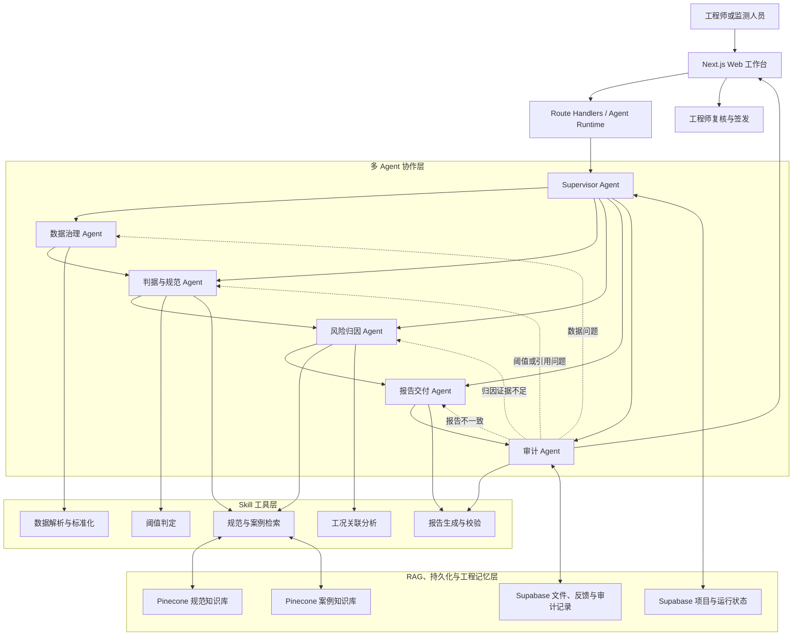
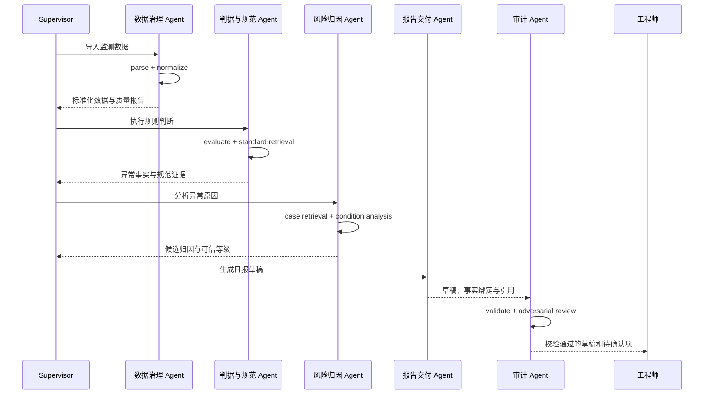

# ExcavaGuard Skill 编排与多 Agent 框架 Demo

## 一、框架定位

ExcavaGuard 采用五层架构：

1. Web 交互与应用层负责对话、文件上传、运行轨迹、人工确认和日报预览。
2. 多 Agent 协作层负责理解任务、规划流程、选择能力、处理冲突和组织交付。
3. Skill 工具层负责执行边界明确、可以测试和复现的业务操作。
4. RAG、持久化与工程记忆层负责提供规范、案例、项目状态和历史反馈。
5. 确定性规则层负责全部数值计算与阈值判断。

核心关系可以概括为：

> Agent 负责决策与协作，Skill 负责可靠执行，RAG 负责提供证据，规则引擎负责工程事实，工程师负责最终签发。

多 Agent 的价值不在于角色数量，而在于形成规划、执行、质疑、退回和人工确认的完整过程。

## 二、总体架构


```mermaid
flowchart TB
    U[工程师或监测人员] --> W[Next.js Web 工作台]
    W --> API[Route Handlers / Agent Runtime]
    API --> S[Supervisor Agent]

    subgraph A[多 Agent 协作层]
        S --> D[数据治理 Agent]
        S --> J[判据与规范 Agent]
        S --> C[风险归因 Agent]
        S --> R[报告交付 Agent]
        S --> Q[审计 Agent]

        D --> J
        J --> C
        C --> R
        R --> Q

        Q -. 数据问题 .-> D
        Q -. 阈值或引用问题 .-> J
        Q -. 归因证据不足 .-> C
        Q -. 报告不一致 .-> R
    end

    subgraph K[Skill 工具层]
        K1[数据解析与标准化]
        K2[阈值判定]
        K3[规范与案例检索]
        K4[工况关联分析]
        K5[报告生成与校验]
    end

    subgraph M[RAG、持久化与工程记忆层]
        M1[Pinecone 规范知识库]
        M2[Pinecone 案例知识库]
        M3[Supabase 项目与运行状态]
        M4[Supabase 文件、反馈与审计记录]
    end

    D --> K1
    J --> K2
    J --> K3
    C --> K3
    C --> K4
    R --> K5
    Q --> K5

    K3 <--> M1
    K3 <--> M2
    S <--> M3
    Q <--> M4

    Q --> W
    W --> H[工程师复核与签发]
```

### 2.1 实现形态

- 主交付是独立 Web 应用，不依赖桌面 Agent 软件才能运行。
- MVP 采用 Next.js + TypeScript 单体全栈，Route Handlers 承载服务端接口，不额外拆分 Python 后端。
- Vercel AI SDK 或等价适配层负责服务端模型调用与流式事件；LangGraph.js 优先用于共享状态、条件路由、重试、退回和人工确认。
- 六类 Agent 是单一应用进程中的逻辑角色，不要求六个模型或六个独立服务。各角色通过独立提示词、工具白名单、结构化输入输出和终止条件形成职责隔离。
- Zod 负责运行时数据契约；Supabase PostgreSQL/Storage 保存工程状态、会话、文件和审计记录；Pinecone 保存规范与案例向量索引。
- WorkBuddy 专家、企业智能体或 MCP 接入只作为主链路完成后的附加适配，并复用同一套 Skill、规则和检索能力。

### 2.2 初始化代码范围（2026-10-09）

本轮先建立可启动的应用骨架，不等同于完整 MVP：

- `src/app/`：App Router 页面、布局及 `api/health`、`api/runs` Route Handlers。
- `src/components/`：工作台空状态、流程说明等界面组件。
- `src/contracts/`：运行请求、角色与 Skill 标识的 Zod 契约；禁止引用服务端模块。
- `src/server/agents/`：六类角色及工具白名单的静态注册信息，尚不执行模型或编排。
- `src/server/skills/`：八个既有 Skill 的契约路径与实现状态；确定性实现仍放在根目录 `skills/<name>/scripts/`。
- `src/server/integrations/`：LLM、Supabase、Pinecone 的延迟初始化入口，密钥仅在服务端读取。未指定模型前不提供默认模型。
- `tests/`：接口边界、配置校验和注册信息一致性测试。

`GET /api/health` 只表示应用进程可响应，不代表外部服务可用。`POST /api/runs` 的初始化请求使用 `project_id`、`monitoring_file_id`、`report_date` 三个必填字段；前两项为未来持久化资源的 UUID，日期为有效的 `YYYY-MM-DD`。这些字段仅是接口外壳，尚不验证资源存在性或所有权。

接口拒绝不合法输入；合法请求也返回 HTTP 501、`FEATURE_NOT_IMPLEMENTED`，不分配运行 ID、不写数据库、不执行 Skill、不生成报告。鉴权、项目与文件表、上传、完整共享工程状态及 Supervisor 状态图在后续纵向链路中实现。第六节状态对象仍是目标设计，不能将其空对象直接当作已通过校验的工程事实。

## 三、Skill 职责

### 3.1 `parse-monitoring-data`

负责读取原始 CSV 数据、识别表头、核验必填字段并输出结构化原始记录。

它只保证数据能够被正确解析，不负责单位换算、异常判断或工程归因。文件不可读、表头缺失或没有有效数据行时，应停止流程并返回明确错误。

### 3.2 `normalize-monitoring-data`

负责统一点号、时间、监测项名称、方向、数值格式和长度单位，并检查重复记录和非法值。

该 Skill 将不同来源的数据转换为统一的数据契约，为后续计算提供稳定输入。未知单位、无效时间或重复测点不得静默修复，应提交数据治理 Agent 处理。

### 3.3 `evaluate-thresholds`

负责根据项目配置的规则计算累计值、单次变化量和日变化速率，并形成逐测点的结构化判定结果。

所有计算必须由确定性脚本完成，输出需要包含输入值、阈值、公式、规则 ID 和超限状态。该 Skill 不负责解释异常原因，也不能自行从自然语言中推断工程阈值。

### 3.4 `retrieve-standard-evidence`

负责从规范知识库中检索与当前监测项、工程条件和规则相符的条文证据。

输出应包含规范名称、版本、条文号、原文、适用条件、来源位置和匹配信息。检索结果用于解释规则依据，不能替代规则引擎重新判断是否超限。

### 3.5 `retrieve-similar-cases`

负责根据支护形式、土层、地下水、施工阶段、监测类型、异常方向和变化速率等条件检索类似工程案例。

输出必须同时展示相似条件和差异项。历史案例仅提供经验参照，不能改变规范阈值，也不能把相似性直接表述为因果关系。

### 3.6 `analyze-work-condition`

负责将规则引擎确认的异常事实与施工工况进行时间、空间、方向和量级上的关联分析。

该 Skill 输出候选原因、支持证据、反证、局限性和可信等级。证据不足或相互冲突时，必须返回“信息不足，建议人工复核”。

### 3.7 `render-daily-report`

负责将结构化事实、规范证据、案例证据和归因结果填入批准的日报模板。

报告中的数字只能来自规则引擎输出，引用只能来自带证据 ID 的检索结果。输出必须标记为草稿，并保留事实字段与报告字段之间的绑定关系。

### 3.8 `validate-report`

负责在报告交付前检查数字、超限状态、规则 ID、引用、模板字段和责任边界。

发现不一致时只返回错误清单，不输出可以被误认为正式报告的成品。该 Skill 不修改事实来适应报告，也不代替工程师审核和签发。

## 四、Skill 编排

### 4.1 正常流程


```mermaid
sequenceDiagram
    participant S as Supervisor
    participant D as 数据治理 Agent
    participant J as 判据与规范 Agent
    participant C as 风险归因 Agent
    participant R as 报告交付 Agent
    participant Q as 审计 Agent
    participant H as 工程师

    S->>D: 导入监测数据
    D->>D: parse + normalize
    D-->>S: 标准化数据与质量报告
    S->>J: 执行规则判断
    J->>J: evaluate + standard retrieval
    J-->>S: 异常事实与规范证据
    S->>C: 分析异常原因
    C->>C: case retrieval + condition analysis
    C-->>S: 候选归因与可信等级
    S->>R: 生成日报草稿
    R-->>Q: 草稿、事实绑定与引用
    Q->>Q: validate + adversarial review
    Q-->>H: 校验通过的草稿和待确认项
```

### 4.2 条件分支

Skill 不应始终机械地全部执行，Supervisor 根据中间状态动态选择路径。

| 条件 | 后续动作 |
| --- | --- |
| 数据字段缺失或单位未知 | 暂停流程，由数据治理 Agent 请求补充 |
| 数据有效且没有异常 | 跳过案例检索和归因，生成常规日报 |
| 存在异常且工况完整 | 进入规范检索、案例检索和归因流程 |
| 存在异常但工况缺失 | 保留超限事实，归因部分主动弃权 |
| 未找到适用规范证据 | 禁止生成规范性解释，提交人工核验 |
| 没有高质量相似案例 | 不进行案例归因，但不影响超限事实 |
| 审计发现数字不一致 | 退回报告交付 Agent 重新生成 |
| 审计发现阈值来源不明 | 退回判据与规范 Agent |
| 证据冲突无法消解 | 停止自动流程，提交工程师裁决 |

## 五、多 Agent 设计

### 5.1 Supervisor Agent

Supervisor 是系统唯一的总控角色，负责：

- 理解用户目标并建立任务计划；
- 根据当前状态选择下一位专业 Agent；
- 维护任务阶段、运行次数和终止条件；
- 汇总专业 Agent 返回的结构化结果；
- 识别冲突并决定退回、重试或请求人工确认；
- 防止流程无限循环；
- 在审计通过后将报告提交工程师。

Supervisor 不直接计算监测数值，不直接编造工程结论，也不能绕过审计 Agent。

### 5.2 数据治理 Agent

数据治理 Agent 调用：

- `parse-monitoring-data`
- `normalize-monitoring-data`

它负责理解不同监测文件的字段结构、识别数据质量问题，并判断数据是否可以进入分析流程。当字段映射存在多种可能时，应询问用户或工程师，而不是自行猜测。

### 5.3 判据与规范 Agent

判据与规范 Agent 调用：

- `evaluate-thresholds`
- `retrieve-standard-evidence`

它负责把计算事实与规则、规范证据绑定，形成“输入数据—计算过程—判定结果—规范依据”的完整链路。如果项目专项方案与通用规范存在冲突，该 Agent 只呈现冲突，不自行选择。

### 5.4 风险归因 Agent

风险归因 Agent 调用：

- `retrieve-similar-cases`
- `analyze-work-condition`

它负责提出可验证的候选原因，并区分支持证据、反证和缺失信息。输出应采用分级措辞，例如“证据支持”“可能相关”“仅供参考”和“无法研判”。

### 5.5 报告交付 Agent

报告交付 Agent 调用：

- `render-daily-report`

它根据不同用户需求组织日报、异常摘要和证据说明，并支持用户展开某个测点的分析过程。它只能消费结构化事实，不能自行修改上游结果。

### 5.6 审计 Agent

审计 Agent 调用：

- `validate-report`
- 必要时重新调用规范或案例检索 Skill

它采用反方视角检查：

- 数字是否与源数据一致；
- 阈值是否具有明确来源；
- 规范条文是否真的支持当前结论；
- 案例是否仅为表面相似；
- 相关性是否被错误表述为因果性；
- 是否出现自动预警、自动签发或过度确定的措辞；
- 是否遗漏关键数据缺口。

审计 Agent 发现问题后，必须退回责任 Agent，不得直接修改源事实。

## 六、共享工程状态

所有 Agent 通过一个由 Zod 校验并持久化的结构化状态对象协作，避免依靠自然语言隐式传值。聊天消息只用于交互，不作为工程事实的唯一存储。

```json
{
  "task": {
    "run_id": "",
    "status": "created",
    "current_stage": "",
    "retry_count": 0
  },
  "project": {},
  "raw_data": {},
  "normalized_data": {},
  "data_quality": {},
  "judgments": {},
  "standard_evidence": {},
  "case_evidence": {},
  "attributions": {},
  "report_draft": {},
  "audit_result": {},
  "human_decisions": {},
  "trace": []
}
```

每次 Agent 或 Skill 调用均向 `trace` 追加：

- 调用者；
- 被调用能力；
- 输入摘要；
- 输出摘要；
- 使用的规则或证据 ID；
- 警告和错误；
- 开始与结束时间；
- 是否触发重试、退回或人工确认。

## 七、冲突处理

### 7.1 规范冲突

当多个规范或项目专项方案给出不同要求时，系统保留全部来源、版本和适用条件，将冲突提交工程师。Agent 不通过投票选择工程事实。

### 7.2 规范与案例冲突

规范判据始终决定是否超限。案例只能解释可能原因，不能因为历史案例结果较轻而降低当前超限等级。

### 7.3 报告与事实冲突

结构化事实表是报告数字和状态的唯一来源。报告与事实不一致时，审计 Agent 退回报告交付 Agent，禁止通过修改事实迁就文本。

### 7.4 Agent 意见冲突

Supervisor 收集各 Agent 的依据，比较其数据来源、适用条件和可信等级。无法通过现有证据消解时，系统停止自动决策并请求人工确认。

## 八、记忆设计

后续可以把工程记忆分成四类：

| 记忆类型 | 内容 | 作用 |
| --- | --- | --- |
| 项目记忆 | 基坑等级、支护形式、阈值、测点布置 | 避免每天重复配置 |
| 过程记忆 | 历史监测值、施工事件、既往异常 | 支持跨日趋势和连续分析 |
| 人工反馈 | 工程师确认、修改或否决的结论 | 优化后续表述与字段映射 |
| 审计记录 | 每次使用的数据、规则、证据和输出 | 支持追溯与责任界定 |

记忆不应直接覆盖规范规则。人工反馈如果涉及阈值或规则变化，必须经过明确审批后进入项目配置。

## 九、智能体深度

比赛演示中的技术深度主要体现在以下能力：

- 动态规划：根据数据质量和异常状态改变流程。
- 工具调用：Agent 自主选择并组合不同 Skill。
- 多角色协作：不同 Agent 围绕同一个结构化工程状态工作。
- 反思审计：审计 Agent 主动寻找反证和不一致。
- 条件回退：错误被退回具体责任 Agent，而不是重新运行全部流程。
- 主动弃权：证据不足时停止归因。
- 长期记忆：结合历史数据和工程师反馈处理后续日报。
- 人机协同：关键冲突、预警和签发保留给工程师。

这些机制应当在系统运行轨迹和交互界面中可见，而不是只出现在架构图或答辩描述中。

## 十、Demo 场景

推荐准备三组独立样例，避免把“整批弃权”和“问题行隔离”混为一谈：

1. 数据错误样例：数据治理 Agent 发现未知单位，按当前 Skill 契约整批停止，不调用下游 Agent，并列出待确认项。
2. 正常样例：数据治理通过，判据 Agent 确认无异常，Supervisor 跳过案例检索与风险归因，直接生成常规日报草稿。
3. 异常样例：判据 Agent 确认超限，规范检索返回条文、版本和适用条件，风险归因 Agent 比对工况和相似案例，报告交付 Agent 生成草稿。
4. 在异常样例中，审计 Agent 发现一处归因证据不足，将任务退回风险归因 Agent。
5. 风险归因 Agent 降低可信等级或主动弃权，审计通过后系统将草稿与待确认项交给工程师。

Web 界面需要同步展示 Agent 当前阶段、Skill 调用、证据 ID、退回轨迹和人工确认入口。这个过程用于证明系统具备动态分支、工具调用、多 Agent 协作、反思纠错和人工责任边界，而不只是 RAG 对话。

## 十一、开发顺序

第一阶段稳定最小 CSV 契约和 Skill 错误边界，初始化 Next.js + TypeScript 应用，并为确定性 Skill 准备可人工核验的测试样例。

第二阶段建立 Zod 共享状态、服务端 Route Handlers 和 Supervisor，跑通“上传—解析—标准化—判定—基础草稿—校验”的纵向链路。

第三阶段接入 Supabase 与规范知识库，实现状态持久化、文件管理、证据引用和适用性过滤。

第四阶段接入案例库与受约束的风险归因，再加入审计 Agent、责任 Agent 退回、人工确认和完整运行轨迹。

第五阶段完善 Web 工作台，集中展示对话、Agent 状态、Skill 调用、证据链、异常原因、日报预览和导出。

第六阶段在 Web 主链路稳定后增加 WorkBuddy 专家、企业智能体或 MCP 适配，不将平台配置替代核心代码。
